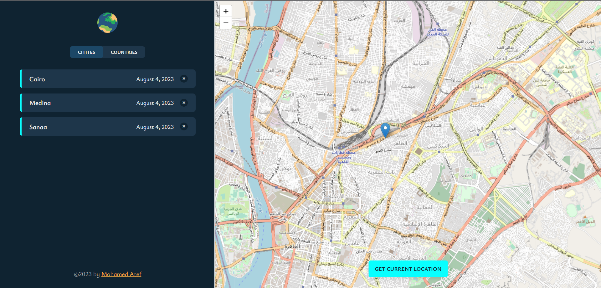
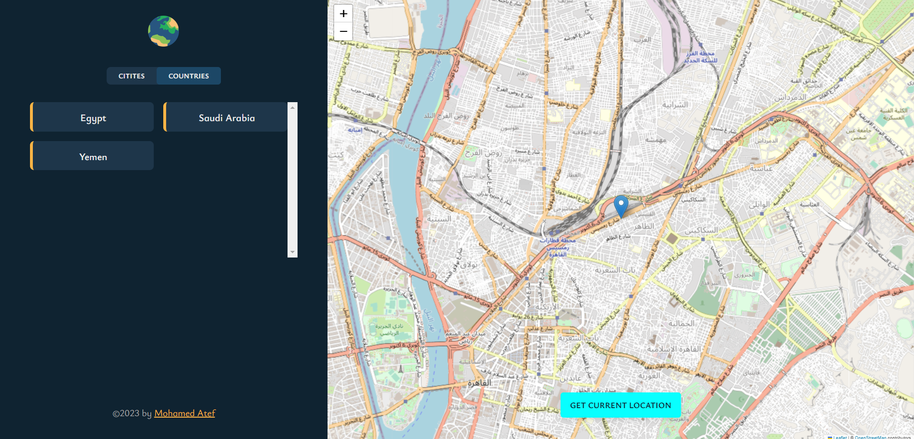
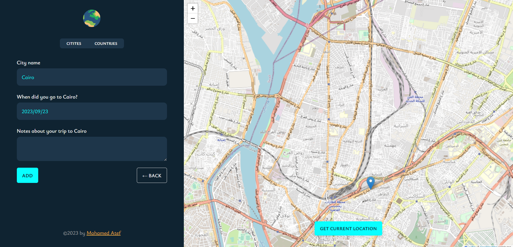
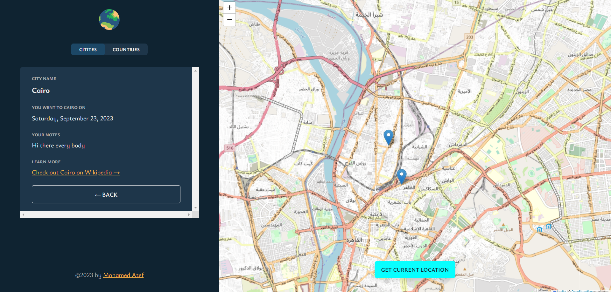
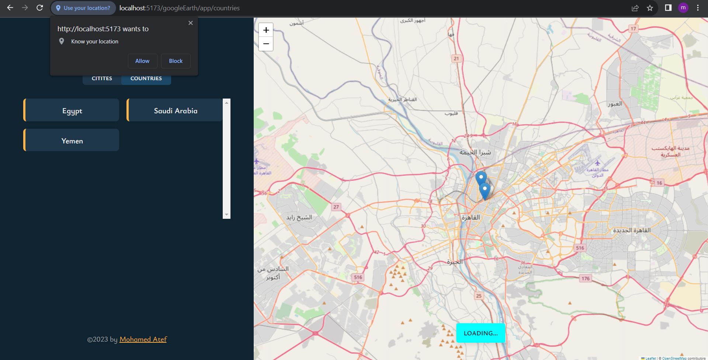
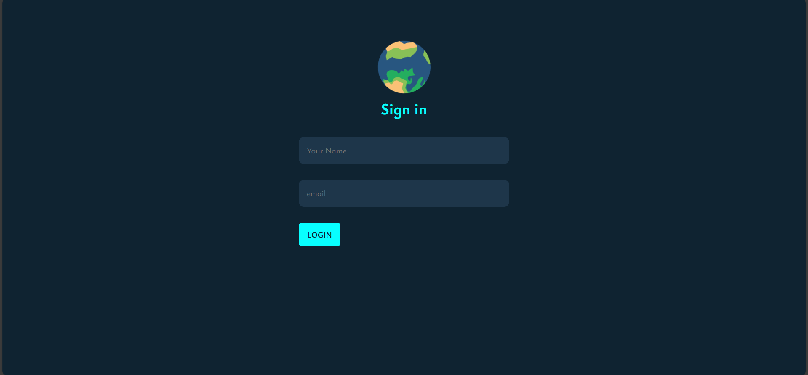

# WorldWise

# This app helps users who travel frequently to make notes about the countries they have visited along with notes about each country.

### Users experience

- Users will have an optimal experience with the app because it will dynamically adjust its layout to fit their device's screen size.
- Users should be able to log in with a fake login, and then they can use the app.
- When a user enters the app, they can click on any place on the map or obtain their address using location services.
- Afterward, a form will appear for the user to write their note about the country and add it to the list.
- Every country the user visits will have a location marker sign drawn on the country on the map.

### Links

- Live Site URL: [click here](https://mohamedate.github.io/worldwise/)

## My process

### Built with

- React & Vite
- react-leaflet
- CSS module
- [React](https://reactjs.org/) - JS library

### What I learned

I have learned a lot of powerful techniques in React, such as managing state with `Context Api` `React Router`, rendering components conditionally, how to split large code to small components
and many other fun things.

## Author

- Website - [Visit my website](https://mohamedate.github.io/Mohamed_Atef/)
